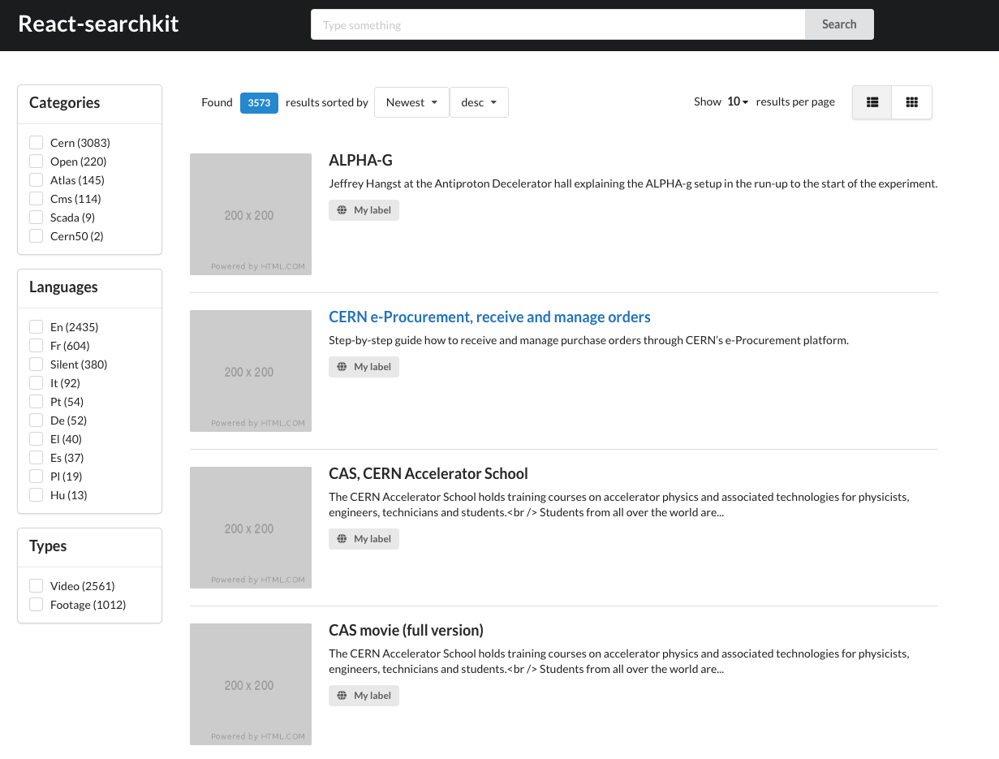

<!--
  This file is part of React-SearchKit.
  Copyright (C) 2018-2019 CERN.

  React-SearchKit is free software; you can redistribute it and/or modify it
  under the terms of the MIT License; see LICENSE file for more details.
-->

# React-SearchKit

[](https://travis-ci.org/inveniosoftware/react-searchkit)
[](https://www.npmjs.com/package/react-searchkit)
[](https://github.com/inveniosoftware/react-searchkit/blob/master/LICENSE)

React-SearchKit is a React library that allows you to build in an easy way your search application.
Read more

Main features:

* ready-to-use collection of UI components
* configurable REST API endpoint and serialization
* configurable URL parameters handling



## Developer guide

React-SearchKit uses [create-react-app](https://create-react-app.dev/) as development toolkit.

Install the library:

```
npm install
```

Start the demo application:

```
npm start
```

The library uses [Jest](https://jestjs.io/) as test runner. To run the tests:

```
npm test
```

The library uses `babel` to build a final version inside the `/lib` folder:

```
npm build
```
