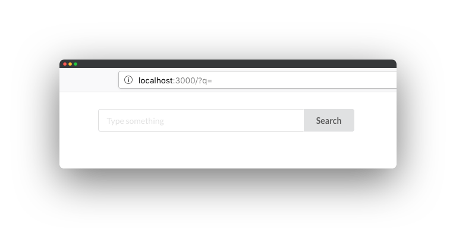
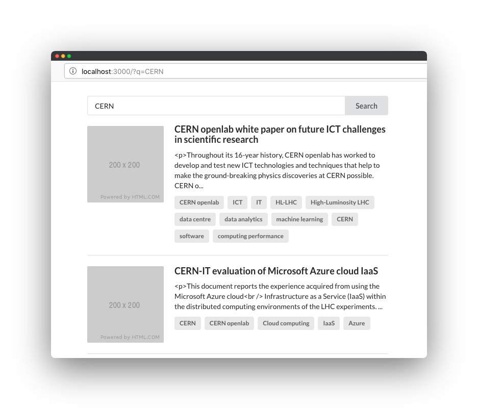

## Create a new app

Let's create a simple search app using [create-react-app](https://github.com/facebook/create-react-app):

```console
npx create-react-app search-app
cd search-app
```

Then, install the React-SearchKit.

```console
npm install react-searchkit
```

React-SearchKit does not come with dependencies: all dependencies are declared as `dev` and `peer`, to allow you to use
your own version of dependencies (e.g. React) in your application.

> Make sure you install all `peer` dependencies when using React-SearchKit!

## Bootstrap it

Open your main App component, e.g. `src/App.js`, and add the main `react-searchkit` component.

First, import the main component `ReactSearchKit`.
```jsx
import { ReactSearchKit } from 'react-searchkit';
```

Then, add it to the content of your `render()` method to render [ReactSearchKit](components/react_search_kit.md).
You should end up with something similar to:

```jsx
import React, { Component } from 'react';
import { ReactSearchKit } from 'react-searchkit';

class App extends Component {
  render() {
    return (
      <ReactSearchKit>
        <h1>My search UI</h1>
      </ReactSearchKit>
    );
  }
}

export default App;
```

## Connect REST API endpoint

Change the `ReactSearchKit` props to define the REST API endpoint. For this example we are going to use [Zenodo APIs](https://zenodo.org).
Import the Invenio adapter and provide the minimal configuration.

```jsx
import React, { Component } from 'react';
import { ReactSearchKit, InvenioSearchApi } from 'react-searchkit';

const searchApi = new InvenioSearchApi({
  url: 'https://zenodo.org/api/records/',
  timeout: 5000,
  headers: { Accept: 'application/vnd.zenodo.v1+json' },
});

class App extends Component {
  render() {
    return (
      <ReactSearchKit searchApi={searchApi}>
        <h1>My search UI</h1>
      </ReactSearchKit>
    );
  }
}
```

> Note: `React-SearchKit` comes out of the box with support to ElasticSearch 7 and [Invenio](https://inveniosoftware.org) REST APIs. To connect your own REST APIs, you can override the default configuration or provide your own adapter for your backend. Follow the next steps of this guide for detailed instructions on how to do it.

## Add the first component

Import the [SearchBar](components/search_bar.md) component.

```jsx
import { ReactSearchKit, InvenioSearchApi, SearchBar } from 'react-searchkit';
```

Then, add the component as a child of `ReactSearchKit`.

```jsx
class App extends Component {
  render() {
    return (
      <ReactSearchKit searchApi={searchApi}>
        <div style={{ margin: '2em auto', width: '50%' }}>
          <SearchBar />
        </div>
      </ReactSearchKit>
    );
  }
}
```

The page should look like to this:



If you hit `Search`, you should see a network request happening with the search query string that you have inserted
in the input field.

## Display the results

Import the [ResultsList](components/results_list.md) component.

```jsx
import { ReactSearchKit, InvenioSearchApi, SearchBar, ResultsList } from 'react-searchkit';
```

Then, add the component below the search bar.

```jsx
class App extends Component {
  render() {
    return (
      <ReactSearchKit searchApi={searchApi}>
        <div style={{ margin: '2em auto', width: '50%' }}>
          <SearchBar />
          <ResultsList />
        </div>
      </ReactSearchKit>
    );
  }
}
```

After reload, you should the list of results after typing a query string in the search input and hitting `Search`.



## Complete demos

In the `src/demos` folder, you can find multiple working example where you see and try most of the components.
Check the `README.md` file to learn how to start the demo application.
